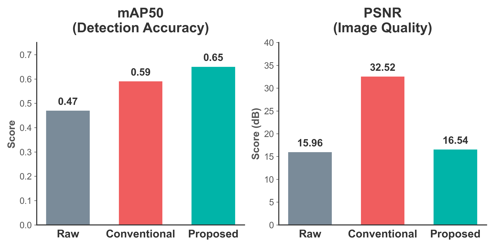
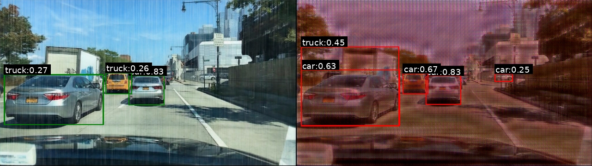

# E2E Adverse-Weather Detector

> **End-to-End joint image restoration and object detection** for autonomous driving in adverse weather.  
> Histoformer (DHSA transformer) → YOLOv8 detection, trained in a single backward pass.

[](https://www.python.org/)
[](https://pytorch.org/)
[](LICENSE)

---

## Motivation

Conventional pipelines apply image restoration as a **pre-processing step** before detection.  
The restoration model is optimized only for image quality (PSNR/SSIM) — not for detection accuracy.

**Our approach:** fuse both objectives into a *single differentiable pipeline* so that the restoration network learns to produce outputs that help the detector, even at the cost of perceptual quality.

| | mAP@50 ↑ | PSNR (dB) ↑ |
|---|---|---|
| Raw (no processing) | 0.47 | 15.96 |
| Conventional (restoration → detect) | 0.59 | **32.52** |
| **Proposed (E2E, ours)** | **0.65** | 16.54 |

> The PSNR drop in our method is **intentional** — the restoration branch sacrifices pixel fidelity in order to sharpen detection-relevant features.

---

## Key Results

### fig1 — Performance trade-off (mAP50 & PSNR)



*Left: Proposed achieves the highest mAP@50. Right: PSNR drops — the restoration is "tuned for detection", not for human visual quality.*

### fig2 — Detection comparison



*Left: conventional restore-then-detect pipeline. Right: our E2E model — more boxes detected correctly under adverse weather.*

---

## Architecture

```
weather_img  (B, 3, H, W)
      │
┌─────▼─────────────────────────┐
│  HistoformerRestoration        │  ← DHSA transformer U-Net
│  (Dynamic-Range Histogram SA)  │
└─────┬─────────────────────────┘
      │  restored tensor  ── no disk I/O, still on GPU ──▶
      │
┌─────▼─────────────────────────┐
│      YOLOv8 Detector           │
└─────┬─────────────────────────┘
      │ multi-scale predictions
      ▼
  CompositeLoss  (single backward pass)
  L_total = L_det + λ · L_rest
```

The restored tensor is **never written to disk**; it flows as a GPU `torch.Tensor` directly into YOLOv8.  
This is the "End-to-End" property that enables joint gradient flow.

---

## Loss Function

```
L_total = L_det + λ · L_rest
```

### Detection loss (YOLOv8-style)

$$L_{\text{det}} = w_{\text{box}} \cdot L_{\text{CIoU}} + w_{\text{obj}} \cdot L_{\text{BCE,obj}} + w_{\text{cls}} \cdot L_{\text{BCE,cls}}$$

### Restoration loss

$$L_{\text{rest}} = \lambda_{\text{rec}} \cdot L_{L1} + \lambda_{\text{ssim}} \cdot (1-\text{SSIM}) + \lambda_{\text{cor}} \cdot (1-r) + \lambda_{\text{feat}} \cdot L_{\text{VGG}}$$

### Weight settings (medium\_32g\_251225 run)

| Symbol | Value | Description |
|--------|-------|-------------|
| $\lambda$ | **0.5** | restoration ↔ detection trade-off |
| $w_{\text{box}}$ | 0.05 | CIoU bounding-box regression |
| $w_{\text{obj}}$ | 1.0 | objectness BCE |
| $w_{\text{cls}}$ | 0.5 | class BCE |
| $\lambda_{\text{rec}}$ | 1.0 | L1 pixel reconstruction |
| $\lambda_{\text{ssim}}$ | 0.1 | structural similarity |
| $\lambda_{\text{cor}}$ | 0.1 | Pearson correlation |
| $\lambda_{\text{feat}}$ | 1.0 | VGG-16 perceptual (relu3\_3) |

See [`src/training/losses.py`](src/training/losses.py) for the full implementation.

---

## Quick Start

### 1. Clone & install

```bash
git clone https://github.com/<your-username>/E2E_Weather_Detector.git
cd E2E_Weather_Detector
pip install -r requirements.txt
```

### 2. Download checkpoints

| File | Description | Link |
|------|-------------|------|
| `restoration_best.pt` | Histoformer restoration weight | [Google Drive ↗](#) |
| `yolov8_best.pt` | Fine-tuned YOLOv8 detection weight | [Google Drive ↗](#) |

> **TODO for the repository owner:** upload `checkpoints/medium_32g_251225/restoration_best.pt` and `yolov8_best.pt` to Google Drive and replace `[Google Drive ↗](#)` with the real share links.

Place the downloaded files in `checkpoints/`:
```
checkpoints/
  restoration_best.pt
  yolov8_best.pt
```

### 3. Add sample images

Place 3–5 adverse-weather images in `sample_images/` (see [`sample_images/README.md`](sample_images/README.md)).  
Supported formats: `.jpg`, `.png`, `.bmp`, `.tiff`, `.webp`

### 4. Run inference

```bash
python inference.py \
    --restoration_ckpt checkpoints/restoration_best.pt \
    --detection_ckpt   checkpoints/yolov8_best.pt \
    --input            sample_images/ \
    --output           output/
```

Each output file (`output/<name>_result.jpg`) shows a **side-by-side** comparison:

| Left half | Right half |
|-----------|------------|
| Degraded input (as-is) | Restored + YOLOv8 detections |

---

## Repository Structure

```
E2E_Weather_Detector/
├── inference.py               ← one-click inference script
├── requirements.txt
├── src/
│   ├── models/
│   │   ├── e2e_model.py       ← End-to-End pipeline (restoration → detection)
│   │   ├── restoration_net.py ← Histoformer-style U-Net (DHSA + DualScaleFFN)
│   │   └── yolov8_detector.py ← Ultralytics YOLOv8 wrapper
│   └── training/
│       └── losses.py          ← Composite loss (core innovation)
├── configs/
│   └── inference.yaml         ← default inference config
├── sample_images/             ← put your test images here
├── checkpoints/               ← put downloaded weights here
└── assets/
    ├── fig1.png               ← mAP50 & PSNR bar chart
    └── fig2.png               ← detection comparison
```

---

## Environment

| Requirement | Version |
|-------------|---------|
| Python | 3.10 |
| PyTorch | 2.9.0 (cu128 for RTX 50xx) |
| torchvision | 0.24.0 |
| ultralytics | ≥8.3.228, <9 |
| einops | ≥0.7 |

Full list: [`requirements.txt`](requirements.txt)

---

## Citation

If you use this work, please cite:

```bibtex
@misc{e2e_weather_detector_2025,
  title   = {End-to-End Adverse Weather Detector with Joint Restoration and Detection},
  year    = {2025},
  url     = {https://github.com/<your-username>/E2E_Weather_Detector}
}
```

---

## License

MIT License — see [LICENSE](LICENSE).
